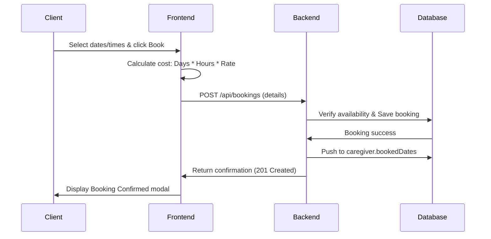
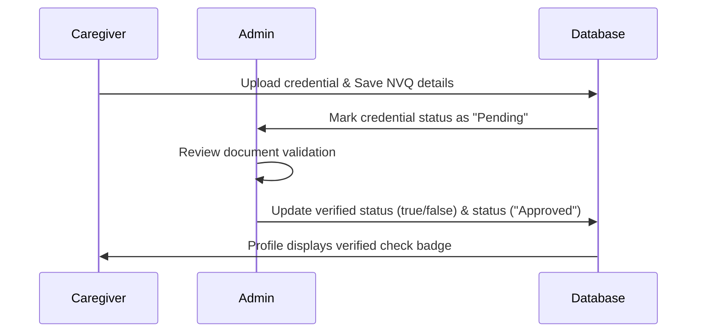

# 📋 Product Requirements Document (PRD)
## CareConnect Caregiver Features & Complaints Management System

| Attribute | Details |
|---|---|
| **Product Name** | CareConnect v1.0 |
| **Status** | Implemented & Ready |
| **Target Audience** | Clients (Care Seekers), Caregivers (Care Providers), Admins (Moderators) |
| **Document Version** | 1.0 |

---

## 1. Executive Summary & Goals

### 1.1 Product Overview
CareConnect is a double-sided healthcare marketplace matching clients in need of care (Childcare, Elderly Care, Hospital Companion, Disability Support) with qualified and verified caregivers. 

### 1.2 Strategic Goals
- **Empowered Matching**: Facilitate immediate caregiver matching based on name searches, location, and specialization categories.
- **Vetted Trust**: Build an NVQ (National Vocational Qualification) and document verification mechanism so clients hire qualified providers.
- **Availability Sanity**: Implement booking sync ensuring confirmed bookings block caregiver availability in real-time.
- **Accountability**: Replace general messaging with a structured, severe-level based Complaints Management System to mediate client issues.

---

## 2. User Roles & Personas

### 2.1 Clients (Care Seekers)
Users looking to hire care services for their loved ones. They require filterable discovery, transparent billing, and a mechanism to raise complaints if service expectations are not met.

### 2.2 Caregivers (Care Providers)
Professionals offering care services. They require profile customization, scheduling slots, credential verification upload (NVQ certificates, IDs), and booking management.

### 2.3 Administrators (Platform Operators)
Internal staff who manage complaints, verify caregiver qualifications, review uploaded credentials, and take action (warnings, refunds, caregiver suspensions).

---

## 3. Functional Requirements

### 3.1 Caregiver Discovery & Matching (Client-Facing)
- **Real-Time Name Search**: Input field with case-insensitive, live matching.
- **Location Filtering**: Dropdown filter supporting 15 Sri Lankan cities:
  * Colombo, Kandy, Galle, Jaffna, Trincomalee, Matara, Negombo, Badulla, Ratnapura, Anuradhapura, Polonnaruwa, Ampara, Batticaloa, Mullaitivu, Vavuniya.
- **Service Type Filtering**: Multi-select dropdown supporting:
  * Childcare, Elderly Care, Hospital Companion Care, Disability Support.

- **Caregiver Profile Modals**: Detailed overlay showing bio, experience duration, hourly rate in LKR (Rs. 1000-1800), verified NVQ certifications, and full weekly availability grids.

### 3.2 Booking & Cost Calculation Engine
- **Flexible Scheduling**: Date range selector (Start Date, End Date) and time selectors (Start Time, End Time).
- **Cost Calculation Model**:
  $$\text{Total Cost} = \text{Total Days} \times \text{Hours Per Day} \times \text{Caregiver Hourly Rate}$$
- **Conflict Resolution**: Booking confirmation updates the `bookedDates` list in the database. Subsequent searches or schedules omit/warn conflict times.

### 3.3 Caregiver Verification & NVQ Management
- **Identity Details**: Storage of ID Type (National Identity Card, Passport) and ID Number.
- **NVQ Certifications Grid**:
  * Support for Levels 1 through 5.
  * Fields: Certification Subject, Issue Date, Expiry Date, Certificate Number, Document Upload URL, and Admin Verified flag.
- **Professional Documents**: Dedicated document repository supporting Category, Title, Expiry Date, and Status (Pending, Approved, Rejected).

### 3.4 Complaints Management System (Admin-Mediated)
- **Submit Complaint Flow**: Clients submit complaints tied to a caregiver and booking.
  * *Categories*: Service Quality, Behavior, Payment, Cancellation, Other.
  * *Severity Levels*: Low, Medium, High, Critical.
- **Admin Management Panel**:
  * Admins review open complaints.
  * *Status Transitions*: `open` $\rightarrow$ `in_progress` $\rightarrow$ `resolved` / `closed`.
  * *Actions*: Admin notes log, Warning issued, Refund initiated, Caregiver suspended.
- **Visual Alert System**: Dashboard notifications displaying warning icons and active complaints count.

### 3.5 Integrated Payments System (PayHere Integration)
- **Sri Lankan Payment Support**: Integration with local payment provider PayHere for handling bookings checkouts.
- **Payment Lifecycle**:
  * Unpaid bookings show a "Continue Payment" action on the client bookings interface.
  * The backend generates checkout forms with signatures based on the MD5 hash of (Merchant ID + Order ID + Amount + Currency + Secret Key).
  * Form details are sent to the frontend to automatically redirect clients to the PayHere sandbox/production checkout page.
- **Instant Payment Notification (IPN)**: Webhook handler `/api/payhere/webhook` processes real-time transaction events sent by PayHere, updating the booking's `paymentStatus` to `paid` and recording the `transactionId` in the database.

---

## 4. Technical Architecture Summary

### 4.1 Core Schema Specifications
- **Caregiver Schema Extensions**:
  * `location` (String Enum, local cities)
  * `serviceTypes` (Array of Strings)
  * `bookedDates` (Array of sub-documents: startDate, endDate, startTime, endTime)
  * `nvqCertifications` (Array of sub-documents)
  * `verificationDocuments` (Array of sub-documents)
- **Complaint Schema**:
  * `clientId` (Reference)
  * `caregiverId` (Reference)
  * `bookingId` (Reference)
  * `title`, `description` (String)
  * `category` (Enum), `severity` (Enum), `status` (Enum)
  * `adminAction` (Enum), `adminNotes` (String)

---

## 5. User & System Flows

### 5.1 Booking Flow

### 5.2 NVQ Verification Flow

---

## 6. Verification and Testing Scope

- **Functional Testing**: Seeding 10 sample caregivers via `node seed-caregivers.js` to verify searching, sorting, filters, and booking constraints.
- **Validation Testing**:
  * Prevent negative date ranges in Booking Modal.
  * Form field validation on identity forms.
  * Correct state transitions of admin complaints action.

---

## 7. Future Considerations

1. **Alternative Gateways**: Expand support for global payment integrations (such as Stripe or PayPal) to facilitate international client bookings.
2. **Automated Document OCR**: Scan uploaded NVQ certificates for validity and match certificate numbers automatically.
